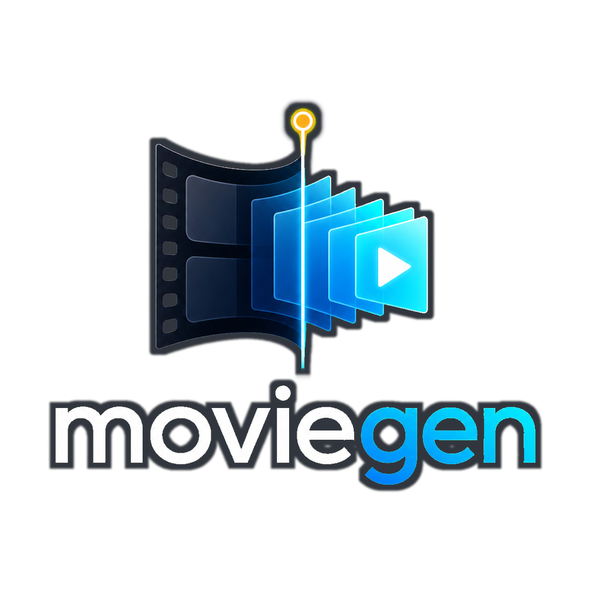
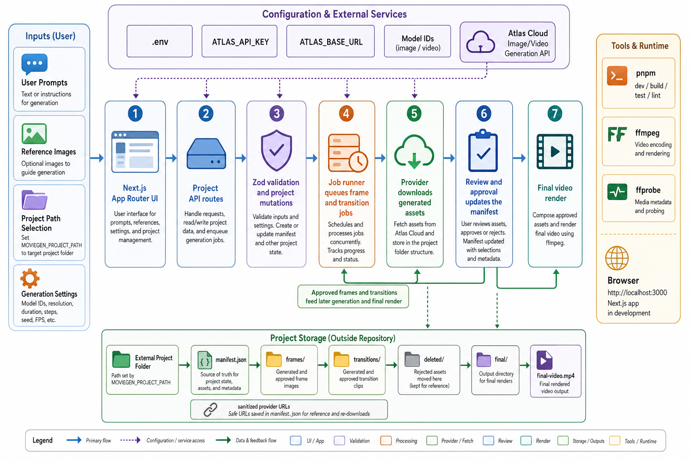

<div align="center">
  
</div>

moviegen is a local Next.js workspace for planning and generating short frame-to-frame movie sequences. It lets you write frame prompts, attach reference images, generate still frames and transition clips through Atlas Cloud, review versions, approve the best assets, and render a final MP4.

Projects are stored in a folder outside this repository. The app keeps a JSON manifest plus generated media assets in that project folder, while the repo stays focused on the editor, API routes, generation pipeline, and tests.

## Install

```bash
pnpm install
keyenv doctor
keyenv run -- pnpm dev
```

Open [http://localhost:3000](http://localhost:3000).

To open a project automatically on startup, set `MOVIEGEN_PROJECT_PATH` to an absolute path outside this repository:

```bash
MOVIEGEN_PROJECT_PATH=/absolute/path/to/moviegen-project pnpm dev
```

## Commands

```bash
pnpm dev             # start the local Next.js app
pnpm build           # build the production app
pnpm start           # run the production build
pnpm lint            # run ESLint
pnpm test            # run Vitest tests
pnpm check:no-media  # check git history for committed media files
```

## Notes

- Use `pnpm`; this repo includes `pnpm-lock.yaml` and `pnpm-workspace.yaml`.
- Private values declared in `.keyenv.toml` live in macOS Keychain and are injected with `keyenv run -- ...`; Node reads them through `process.env`.
- `ATLAS_API_KEY` or `ATLASCLOUD_API_KEY` is required for Atlas Cloud generation; keep the active local key in Keychain rather than `.env`.
- `ATLAS_BASE_URL`, model IDs, Seedance defaults, `FFMPEG_PATH`, and `FFPROBE_PATH` can be overridden with environment variables.
- `NEXT_PUBLIC_GA_MEASUREMENT_ID` enables GA4 page-view tracking when configured.
- Project paths must be absolute and outside the app workspace.
- Project folders contain `manifest.json`, `frames/`, `transitions/`, `deleted/`, and final renders under `final/`.
- Final video rendering uses `ffmpeg`; media probing uses `ffprobe`.
- Generated media should not be committed. `architecture.png` is the only tracked PNG allowed by the media guard.

## Architecture



## License

No license file is currently included.
